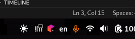

# Mic Indicator Visibility Manager

You create a virtual mic or a loopback device, then suddenly you have this orange mic icon screaming at you even when no application is using the mic:



After using this extension, it will be simply hidden **and only shown when an application is actually using the virtual mic**


This extension provides filtering capabilities to control when the microphone indicator is shown:
1. Hide virtual sources (sources with `node.virtual = "true"`)
2. Hide specific applications based on their `application.id`
3. Hide sources based on any property-value combination

# How to install
Simply git clone this repository into the appropriate gnome extensions folder:

```sh
git clone \
    https://github.com/moalhaddar/mic-indicator-visibilty-manager \
    $HOME/.local/share/gnome-shell/extensions/mic-indicator-visibility-manager@alhaddar.dev
```

# How does it work?
`gnome-shell` by default shows the mic indicator if any `source-outputs` exists, excluding some apps.

This extension enhances that logic with multiple filtering capabilities:

1. **Virtual Sources**: Optionally hide sources with `node.virtual = "true"`
2. **Application Filtering**: Hide specific applications based on their `application.id`
3. **Property Filtering**: Hide sources based on any property-value combination

## Configuring Filters

### Application Filtering
To hide specific applications:
1. Use the mic in the target application
2. Run `pactl list source-outputs`
3. Find the `application.id` property
4. Add it to the excluded apps list in extension settings

### Property Filtering
To hide sources based on specific properties:
1. Run `pactl list source-outputs` to see available properties
2. Add property:value pairs in the extension settings
3. Each pair should be on a new line in format: `property:value`

Example filters:
```
node.name:MyVirtualMic
media.class:Audio/Source
custom.property:value
```


# Author
Mohammed Alhaddar

# License
MIT