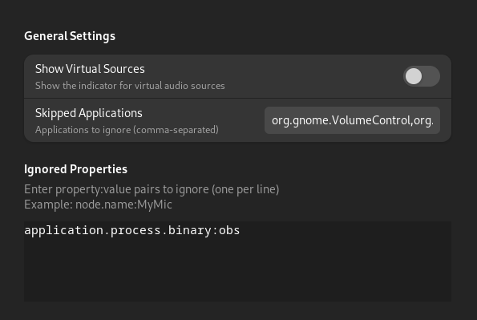

# Mic Indicator Visibility Manager

You created a virtual mic or a loopback device, then you have this orange mic icon screaming at you even when no application is using the mic:


After using this extension, it will be simply hidden **and only shown when an application is actually using the virtual mic**


Another feature that this extension provides is hiding the mic based on the `application.id` property from the `pactl list source-outputs`, this way, you can even hide the mic icon if it's being used by certain trusted apps, such as OBS for example.

# How to install
Simply git clone this repository into the appropriate gnome extensions folder:

```sh
git clone \
    https://github.com/moalhaddar/mic-indicator-visibilty-manager \
    $HOME/.local/share/gnome-shell/extensions/mic-indicator-visibility-manager@alhaddar.dev
```

# How does it work?
`gnome-shell` by default shows this icon if any `source-outputs` exists, excluding some apps.

This extension patches that logic such that it also ignores `source-outputs` with property `node.virtual = "true"` alongside the default excluded apps.

If the icon is shown for you, check the output of `pactl list source-outputs`, if your the source output contains that property, then this extension will work for you.

If you want to hide a specific app, then simply use the mic in that app, run the same `pactl list source-outputs` 
command and get the `application.id` property, and add it to the list of the excluded apps in the extension settings.




# Author
Mohammed Alhaddar

# License
MIT